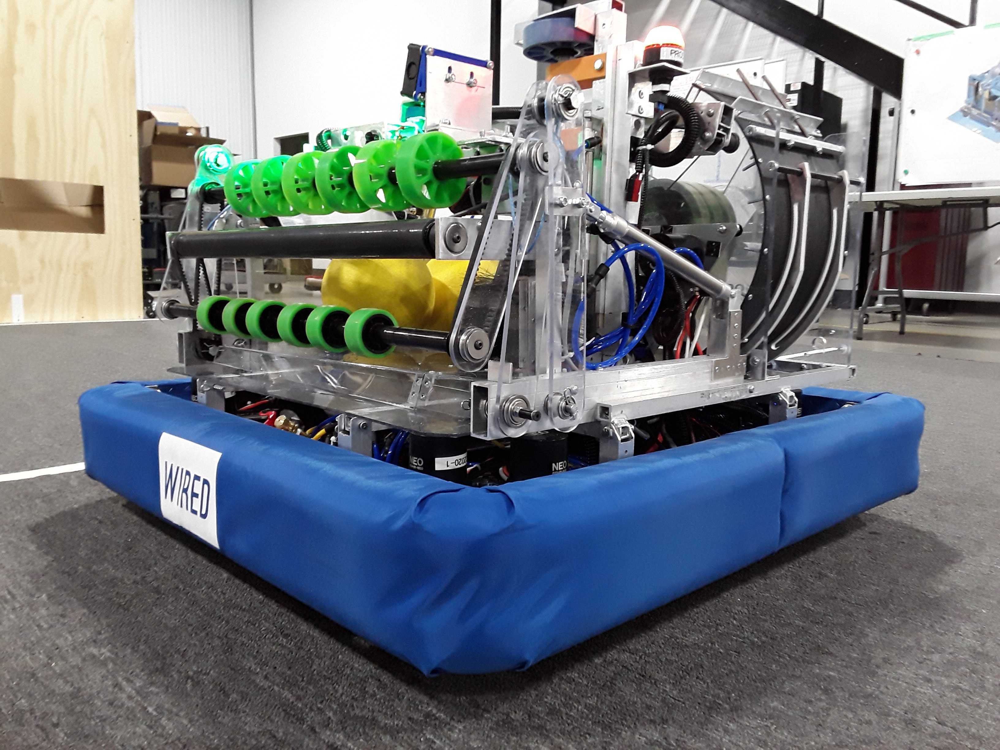

  
    
# MR. MEGA MAID

### Electrical Control Structure

Drivetrain Subsystem

|CAN ID     |Motor Type |Function      |
|-----------|:----------|-------------:|
|8          |Neo        |BR Drive  |
|7          |Neo        |BR Azimuth|
|11         |Neo        |BL Drive  |
|10         |Neo        |BL Azimuth|
|1          |Neo        |FR Drive  |
|2          |Neo        |FR Azimuth|
|5          |Neo        |FL Drive  |
|6          |Neo        |FL Azimuth|

Launcher Subsystem

|CAN ID     |Motor Type |Function      |
|-----------|:----------|-------------:|
|3          |Neo        |Launcher 1    |
|4          |Neo        |Launcher 2    |

|PWM ID     |Motor Type |Function      |
|-----------|:----------|-------------:|
|0          |775        |Gate Motor    |

Indexer / Intake Subsystem

|PWM ID     |Motor Type |Function      |
|-----------|:----------|-------------:|
|1          |BAG        |Index / Intake|

Climber Subsystem

|PWM ID     |Motor Type |Function      |
|-----------|:----------|-------------:|
|2          |775        |Winch         |
|3          |Snowblower |Balancer      |

Spinner Subsystem

|CAN ID     |Motor Type |Function      |
|-----------|:----------|-------------:|
|9          |JE         |Wheel spinner |

### Pneumatic Control Structure

Intake Subsystem

|SOLENOID ID|Function   |
|-----------|:----------|
|0 & 7      |Intake arms|

Climber Subsystem

|SOLENOID ID|Function   |
|-----------|:----------|
|2 & 5      |Locking pin|
|4 & 3      |Main arm   |

Spinner Subsystem

|SOLENOID ID|Function   |
|-----------|:----------|
|1 & 6      |deploy spin|

### Driver Controls

Main Controller

|Button or Axis | Function                                           |
|-------------------|------------------------------------------------|
|Left Joystick      | Forward / Backwards, Strafe Left / Strafe Right|
|Right Joystick     | Rotate Left / Rotate Right                     |
|Left Trigger       |                                                |
|Right Trigger      |                                                |
|Left Stick Button  |                                                |
|Right Stick Button |                                                |
|Left Bumper        |                                                |
|Right Bumper       | Robot oriented                                 |
|Select Button      |                                                |
|Start Button       |                                                |
|Y Button           | Reset Yaw                                      |
|X Button           |                                                |
|B Button           |                                                |
|A Button           | Stay Straight                                  |
|D Pad              |                                                |

Aux Controller

|Button or Axis | Function |
|---------------|----------|
|Left Joystick      | Winch                        |
|Right Joystick     | Troller                      |
|Left Trigger       | Outtake                      |
|Right Trigger      | Intake                       |
|Left Stick Button  | Winch Enable                 |
|Right Stick Button |                              |
|Left Bumper        | Deploy Intake                |
|Right Bumper       | Retract Intake               |
|Select Button      | Climb Lock Dissengage        |
|Start Button       | Climb Arm Deploy/Collapse    |
|Y Button           |                              |
|X Button           | Shoot                        |
|B Button           | Spin                         |
|A Button           | Spinner Deploy               |
|D Pad              |                              |
